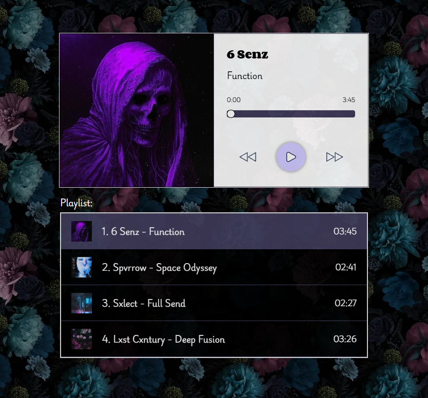

# Audio Player

**RS School Audio Player project** — a custom audio player built with HTML, CSS, and JavaScript featuring a dynamic playlist, track controls, and responsive UI.

## 🌐 Live Demo
* [Netlify](https://rss-audio-player.netlify.app/)
* [GitHub Pages](https://squallerq.github.io/audio-player/)

## 🖥️ Screenshot

## Features
1. Custom audio player with Play / Pause / Next / Prev buttons  
2. Dynamic playlist rendered from a JavaScript array  
3. Track image, artist name, and title display  
4. Current time vs total duration indicators  
5. Clickable progress bar for manual seeking  
6. Automatic song switch when track ends  
7. Active track highlighting in playlist  
8. Responsive layout (desktop & mobile)  

## Tech Stack
- **HTML**
- **CSS**
- **JavaScript**

## Run Locally
1. Clone the repo: git clone https://github.com/SquallerQ/audio-player.git
2. Open index.html in your browser